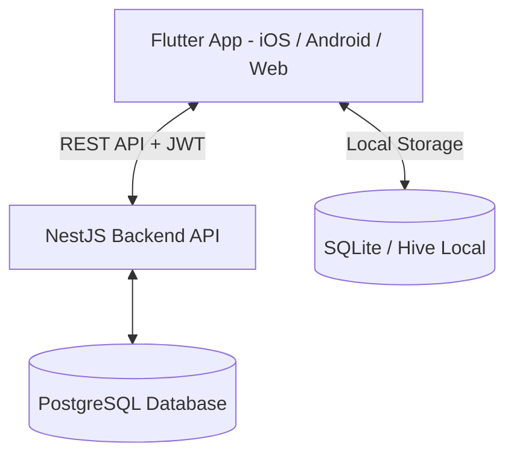

# 💰 Finance Manager - Phần Mềm Quản Lý Chi Tiêu Cá Nhân

> **Finance Manager** là ứng dụng quản lý tài chính cá nhân đa nền tảng (Mobile/Web), hỗ trợ ghi chép thu chi siêu tốc dưới 5 giây, theo dõi đa ví/tài khoản, thiết lập ngân sách thông minh và phân tích báo cáo trực quan.

---

## 🌟 Tính Năng Nổi Bật

- ⚡ **Ghi Chép Siêu Tốc (Fast Entry)**: Giao diện tối ưu thao tác 1-tap, tích hợp bàn phím tính toán trực tiếp.
- 💳 **Quản Lý Đa Ví (Multi-Wallet)**: Theo dõi đồng thời Tiền mặt, Ngân hàng (VCB, TCB...), Ví điện tử (Momo, ZaloPay) và chuyển khoản nội bộ.
- 🎯 **Ngân Sách Thông Minh (Smart Budgeting)**: Tự động cảnh báo khi chi tiêu chạm ngưỡng **80% (Cảnh báo vàng)** và **100% (Cảnh báo đỏ)**.
- 📊 **Báo Cáo Trực Quan (Visual Analytics)**: Biểu đồ tròn cơ cấu chi tiêu và biểu đồ xu hướng thu/chi theo tháng.
- 🔄 **Offline-First & Sync**: Cho phép tạo giao dịch cả khi không có mạng, tự động đồng bộ lên cloud khi online.

---

## 🏗️ Kiến Trúc & Công Nghệ (Tech Stack)



- **Frontend App**: [Flutter](https://flutter.dev/) (Dart) - Nền tảng di động & web đa trải nghiệm.
- **Backend API**: [NestJS](https://nestjs.com/) (TypeScript) - RESTful API kiến trúc Modular Clean Architecture.
- **Database**: PostgreSQL (Server) & SQLite (Mobile Client Offline Storage).
- **Authentication**: JWT (JSON Web Token), OAuth2 / Google Sign-In.

---

## 📂 Cấu Trúc Thư Mục Dự Án

```text
finance-manager/
├── backend/            # Mã nguồn NestJS RESTful API Backend
├── frontend_app/       # Mã nguồn ứng dụng Flutter Mobile & Web
└── documents/          # Thư mục chứa trọn bộ Tài liệu Sản phẩm & Kỹ thuật
    ├── 01-Product-Discovery.md
    ├── 02-Product-Requirements-Document-PRD.md
    ├── 03-Requirements-Analysis.md
    ├── 04-User-Stories-Acceptance-Criteria.md
    ├── 05-Feature-Specifications.md
    └── README.md
```

---

## 📚 Bộ Tài Liệu Kỹ Thuật & Thiết Kế Sản Phẩm

Toàn bộ tài liệu phân tích kỹ thuật và sản phẩm được lưu trữ chi tiết trong thư mục **[`documents/`](documents/README.md)**:

| STT | Tài Liệu | Nội Dung Chính |
|-----|----------|----------------|
| 1 | 🔍 **[01. Khám Phá Sản Phẩm](documents/01-Product-Discovery.md)** | Tầm nhìn, Sứ mệnh, Pain Points, Personas, Phân tích đối thủ & OKRs/KPIs. |
| 2 | 📋 **[02. Tài Liệu Yêu Cầu Sản Phẩm (PRD)](documents/02-Product-Requirements-Document-PRD.md)** | Scope v1.0 vs v2.0, 12 Yêu cầu Chức năng & Yêu cầu Phi chức năng. |
| 3 | 🧠 **[03. Phân Tích Yêu Cầu](documents/03-Requirements-Analysis.md)** | Luồng nghiệp vụ Sequence/Flowchart, Use Case, Mô hình Dữ liệu ERD & Traceability Matrix. |
| 4 | ✍️ **[04. User Stories & Acceptance Criteria](documents/04-User-Stories-Acceptance-Criteria.md)** | Danh sách User Stories chi tiết kèm Tiêu chí chấp nhận dạng **Given-When-Then** (BDD). |
| 5 | ⚙️ **[05. Đặc Tả Tính Năng](documents/05-Feature-Specifications.md)** | Đặc tả UI/UX, Logic nghiệp vụ, Chi tiết RESTful API Contracts & Error Codes. |

---

## 🚀 Hướng Dẫn Cài Đặt & Khởi Chạy (Getting Started)

### 1. Khởi chạy Backend (NestJS)
```bash
cd backend
npm install
npm run start:dev
```
Backend API sẽ chạy tại: `http://localhost:3000`

### 2. Khởi chạy Frontend App (Flutter)
```bash
cd frontend_app
flutter pub get
flutter run
```

---

## 📜 Giấy Phép & Tác Giả
- **Dự án**: Finance Manager

