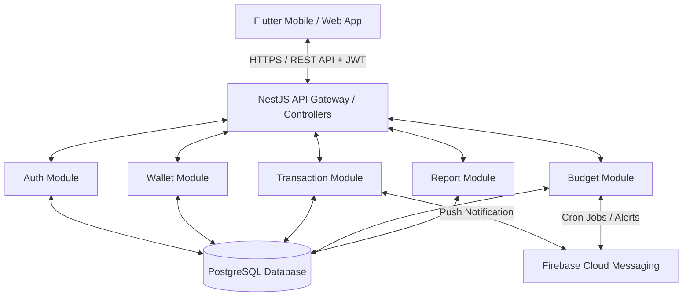

# 02. Tài Liệu Yêu Cầu Sản Phẩm (Product Requirements Document - PRD)

## 1. Tổng Quan Sản Phẩm & Mục Tiêu

### 1.1 Tên dự án
**Finance Manager** (Phần mềm quản lý chi tiêu cá nhân đa nền tảng).

### 1.2 Mục tiêu dự án
Xây dựng hệ thống quản lý tài chính cá nhân gồm **Flutter App (iOS, Android, Web)** và **NestJS Backend RESTful API**, cung cấp nền tảng quản lý tài khoản, thu chi, ngân sách và báo cáo tài chính mượt mà, chính xác và an toàn.

---

## 2. Phạm Vi Sản Phẩm (Product Scope)

### 2.1 In-Scope (Phiên bản v1.0)
- **Xác thực & Tài khoản**: Đăng ký, Đăng nhập (Email/Password, Google OAuth2), Đổi mật khẩu, Quản lý Hồ sơ cá nhân.
- **Quản lý Ví / Tài khoản tài chính**: Tạo, sửa, xóa, ẩn ví tiền (Tiền mặt, Ngân hàng, Ví điện tử), theo dõi tổng tài sản ròng. Chuyển tiền giữa các ví (Wallet Transfer).
- **Quản lý Danh mục Thu/Chi**: Danh mục mặc định và danh mục tùy chỉnh theo người dùng (Cha - Con 2 cấp).
- **Quản lý Giao dịch**: Thêm/Sửa/Xóa giao dịch Thu/Chi, đính kèm ghi chú, ngày tháng, ảnh hóa đơn. Tìm kiếm và lọc giao dịch đa tiêu chí.
- **Quản lý Ngân sách (Budgeting)**: Thiết lập ngân sách theo tháng cho từng danh mục hoặc tổng thể. Thanh tiến độ trực quan và thông báo khi chi tiêu đạt 80% và 100%.
- **Báo cáo & Thống kê**: Biểu đồ cơ cấu chi tiêu (Donut chart), Biểu đồ xu hướng thu chi theo thời gian (Line/Bar chart).
- **Giao dịch định kỳ**: Lập lịch tự động ghi chép thu/chi lặp lại (Hàng ngày, Hàng tuần, Hàng tháng).

### 2.2 Out-of-Scope (Dành cho phiên bản v2.0+)
- Tự động đọc SMS/Notification ngân hàng để quét giao dịch.
- Kết nối trực tiếp API Ngân hàng (Open Banking / Bank Sync API).
- Quản lý danh mục đầu tư chứng khoán, tiền điện tử theo real-time market price.
- Quản lý nhóm / Chi tiêu chung cho gia đình (Shared Household Wallet).

---

## 3. Kiến Trúc Giải Pháp Tổng Quan (Solution Architecture)

---

## 4. Yêu Cầu Chức Năng Tổng Quát (Functional Requirements)

| Mã YC | Nhóm Chức Năng | Mô Tả Yêu Cầu | Mức Độ Ưu Tiên |
|-------|----------------|---------------|----------------|
| **FR-01** | Authentication | Đăng ký, đăng nhập qua Email/Password và Google OAuth2. Quản lý JWT Access Token & Refresh Token. | **Must Have** |
| **FR-02** | User Profile | Xem và cập nhật thông tin cá nhân, đơn vị tiền tệ mặc định (VND, USD), ngôn ngữ. | **Must Have** |
| **FR-03** | Wallet Management | Khởi tạo nhiều ví (Tiền mặt, Ngân hàng, Ví điện tử). Cập nhật số dư ban đầu, chỉnh sửa, ẩn/hiển thị ví. | **Must Have** |
| **FR-04** | Internal Transfer | Chuyển khoản giữa 2 ví thuộc sở hữu của cùng một người dùng (không tính là thu/chi). | **Must Have** |
| **FR-05** | Category Management | Cung cấp cây danh mục mặc định (Ăn uống, Di chuyển, Lương, Thưởng...). Cho phép tạo danh mục tùy chỉnh 2 cấp. | **Must Have** |
| **FR-06** | Transaction Log | Tạo mới giao dịch thu/chi với số tiền, ngày giờ, danh mục, ví, ghi chú. Hỗ trợ chọn nhanh danh mục ưa thích. | **Must Have** |
| **FR-07** | Transaction Filter | Tìm kiếm giao dịch theo từ khóa, lọc theo khoảng thời gian, ví, danh mục, loại thu/chi. | **Must Have** |
| **FR-08** | Budget Setting | Đặt hạn mức chi tiêu theo tháng cho từng danh mục hoặc tổng chi tiêu. Tính toán % chi tiêu còn lại. | **Must Have** |
| **FR-09** | Budget Alert | Gửi Push Notification và hiển thị cảnh báo đỏ trên UI khi chi tiêu vượt 80% và 100% ngân sách. | **High** |
| **FR-10** | Visual Analytics | Hiển thị biểu đồ phân bổ chi tiêu theo danh mục và so sánh thu/chi giữa các tháng. | **Must Have** |
| **FR-11** | Recurring Transaction | Thiết lập giao dịch tự động lặp lại (tiền nhà, tiền điện, lương hàng tháng). Hệ thống tự tạo giao dịch khi tới hạn. | **Medium** |
| **FR-12** | Data Export | Cho phép xuất dữ liệu lịch sử giao dịch ra file CSV / Excel. | **Low** |

---

## 5. Yêu Cầu Phi Chức Năng (Non-Functional Requirements)

### 5.1 Hiệu năng (Performance)
- **Thời gian phản hồi API (API Response Time)**: 95% số lượng request đọc dữ liệu (GET) phải phản hồi dưới 150ms. Các API ghi dữ liệu (POST/PUT/DELETE) phản hồi dưới 300ms.
- **Thời gian khởi động ứng dụng (App Launch Time)**: Cold start < 2 giây trên các thiết bị di động tầm trung.
- **Tốc độ render đồ thị**: Render biểu đồ thống kê dưới 60fps mà không bị giật/lag.

### 5.2 Bảo mật & Quyền riêng tư (Security & Privacy)
- **Mã hóa mật khẩu**: Sử dụng Bcrypt (salt round = 10) để mã hóa mật khẩu người dùng trước khi lưu trữ database.
- **Xác thực API**: Sử dụng JWT bearer token cho tất cả API trừ Auth. Access token hết hạn sau 15 phút, Refresh token hết hạn sau 7 ngày.
- **Mã hóa đường truyền**: Toàn bộ lưu lượng giữa Client và Backend phải đi qua HTTPS (TLS 1.3).
- **Phân quyền dữ liệu (Multi-tenancy isolation)**: Đảm bảo người dùng A tuyệt đối không thể đọc/ghi dữ liệu ví hoặc giao dịch của người dùng B thông qua validation middleware.

### 5.3 Tính Khả Dụng & Tin Cậy (Availability & Reliability)
- **Sẵn sàng dịch vụ**: Uptime của Backend API đạt tối thiểu **99.9%** hàng tháng.
- **Lưu trữ Offline (Offline Capability)**: Ứng dụng Flutter cho phép người dùng xem và tạo giao dịch khi không có mạng (offline mode) bằng cách lưu tạm dưới SQLite/Hive local storage, sau đó tự động đồng bộ (sync) lên server khi có mạng trở lại.

### 5.4 Khả Năng Mở Rộng (Scalability)
- Cấu trúc Backend NestJS được chia theo kiến trúc Modular (Domain-Driven Design nhẹ) giúp dễ dàng tách thành Microservices khi lượng người dùng tăng cao.
- Cơ sở dữ liệu hỗ trợ đánh Index tối ưu theo `user_id`, `created_at`, `category_id`, `wallet_id`.

---

## 6. Quản Lý Rủi Ro & Giải Pháp (Risks & Mitigations)

| STT | Rủi Ro Quản Lý | Mức Độ | Giải Pháp Giảm Thiểu |
|-----|----------------|--------|----------------------|
| 1 | Xung đột dữ liệu khi đồng bộ Offline-Online | Trung bình | Sử dụng chiến lược `Last-Write-Wins` dựa trên timestamp UTC và UUID duy nhất cho từng giao dịch. |
| 2 | Người dùng quên ghi chép dẫn đến dữ liệu không chính xác | Cao | Gửi thông báo nhắc nhở nhẹ nhàng (Smart Reminder) vào 20:30 mỗi tối nếu trong ngày chưa ghi giao dịch nào. |
| 3 | Tốc độ truy vấn báo cáo bị chậm khi lịch sử giao dịch lớn (> 10,000 dòng) | Trung bình | Tạo bảng tổng hợp dữ liệu theo tháng (Monthly Summary Table / Aggregation View) để query báo cáo tức thì. |
