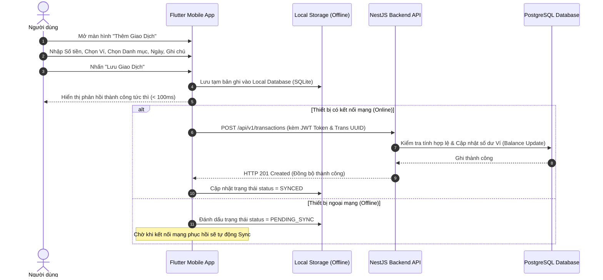
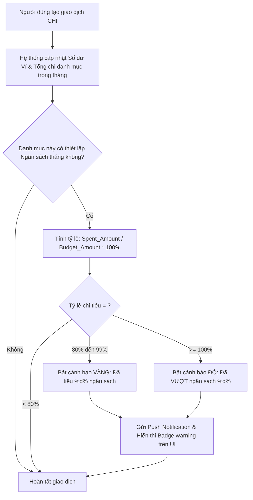

# 03. Phân Tích Yêu Cầu (Requirements Analysis)

## 1. Phân Tích Luồng Nghiệp Vụ (Business Workflows)

### 1.1 Luồng Khởi Tạo Giao Dịch Thu / Chi (Transaction Logging Flow)



### 1.2 Luồng Kiểm Tra & Cảnh Báo Ngân Sách (Budget Monitoring Flow)



---

## 2. Phân Tích Sơ Đồ Trường Hợp Sử Dụng (Use Case Analysis)

### 2.1 Các Tác Nhân (Actors)
- **User (Người dùng phổ thông)**: Người sử dụng app di động/web để quản lý thu chi cá nhân.
- **System Cron Job**: Tiến trình chạy ngầm hàng ngày trên Server để khởi tạo các giao dịch lặp lại và quét cảnh báo.
- **Admin**: Quản trị viên hệ thống (xem báo cáo tổng quan hệ thống, quản lý danh mục mẫu).

### 2.2 Sơ Đồ Use Case Tổng Quan

```mermaid
usecaseDiagram
    actor User as "Người Dùng (User)"
    actor System as "System Cron Job"

    package "Hệ Thống Quản Lý Chi Tiêu (Finance Manager)" {
        usecase UC1 as "Đăng Ký / Đăng Nhập"
        usecase UC2 as "Quản Lý Ví (Thêm/Sửa/Xóa/Xem số dư)"
        usecase UC3 as "Tạo Giao Dịch Thu / Chi"
        usecase UC4 as "Chuyển Tiền Giữa Các Ví"
        usecase UC5 as "Quản Lý Danh Mục Chi Tiêu"
        usecase UC6 as "Thiết Lập Ngân Sách Tháng"
        usecase UC7 as "Nhận Cảnh Báo Vượt Ngân Sách"
        usecase UC8 as "Xem Báo Cáo Thống Kê"
        usecase UC9 as "Tự Động Tạo Giao Dịch Định Kỳ"
    }

    User --> UC1
    User --> UC2
    User --> UC3
    User --> UC4
    User --> UC5
    User --> UC6
    User --> UC7
    User --> UC8

    System --> UC7
    System --> UC9
```

### 2.3 Mô Tả Chi Tiết Case Tiêu Biểu: UC3 - Tạo Giao Dịch Thu / Chi
- **Actor chính**: User.
- **Tiền điều kiện (Pre-condition)**: User đã đăng nhập thành công và có ít nhất 1 Ví active.
- **Kịch bản chính (Main Success Scenario)**:
  1. User nhấn nút `+` (Add Transaction) trên thanh điều hướng.
  2. Hệ thống hiển thị form nhập gồm: Số tiền, Loại (Thu/Chi), Danh mục, Ví, Thời gian (Mặc định: Hiện tại), Ghi chú.
  3. User nhập số tiền `50,000 VND`, chọn danh mục `Ăn uống`, chọn ví `Ví Tiền Mặt`.
  4. User nhấn nút "Lưu".
  5. Hệ thống ghi nhận giao dịch, tự động trừ số tiền `50,000 VND` khỏi ví `Ví Tiền Mặt`.
  6. Hệ thống kiểm tra ngân sách danh mục `Ăn uống` trong tháng.
  7. Màn hình tự động quay về Dashboard với số dư mới đã cập nhật.
- **Kịch bản ngoại lệ (Exception Scenario)**:
  - *3a. Số tiền bằng 0 hoặc âm*: Hệ thống hiển thị thông báo lỗi "Số tiền phải lớn hơn 0".
  - *3b. Chưa chọn danh mục*: Hệ thống yêu cầu người dùng chọn danh mục trước khi lưu.

---

## 3. Mô Hình Dữ Liệu Thực Thể (Entity Data Model / ERD)

```mermaid
erDiagram
    USERS ||--o{ WALLETS : "sở hữu"
    USERS ||--o{ CATEGORIES : "tạo tùy chỉnh"
    USERS ||--o{ TRANSACTIONS : "thực hiện"
    USERS ||--o{ BUDGETS : "thiết lập"
    USERS ||--o{ RECURRING_TRANSACTIONS : "cấu hình"

    WALLETS ||--o{ TRANSACTIONS : "chứa"
    CATEGORIES ||--o{ TRANSACTIONS : "phân loại"
    CATEGORIES ||--o{ BUDGETS : "áp dụng"
    CATEGORIES ||--o{ CATEGORIES : "danh mục cha-con"

    USERS {
        uuid id PK
        string email UK
        string password_hash
        string full_name
        string base_currency
        datetime created_at
    }

    WALLETS {
        uuid id PK
        uuid user_id FK
        string name
        string type "CASH, BANK, E_WALLET"
        decimal balance
        string currency
        boolean is_excluded_from_total
        datetime created_at
    }

    CATEGORIES {
        uuid id PK
        uuid user_id FK "Null if system default"
        uuid parent_id FK "Self reference"
        string name
        string type "INCOME, EXPENSE"
        string icon_name
        string color_hex
    }

    TRANSACTIONS {
        uuid id PK
        uuid user_id FK
        uuid wallet_id FK
        uuid category_id FK
        decimal amount
        string type "INCOME, EXPENSE, TRANSFER"
        datetime transaction_date
        string note
        string receipt_image_url
        datetime created_at
    }

    BUDGETS {
        uuid id PK
        uuid user_id FK
        uuid category_id FK "Null if overall budget"
        decimal limit_amount
        integer month
        integer year
        datetime created_at
    }

    RECURRING_TRANSACTIONS {
        uuid id PK
        uuid user_id FK
        uuid wallet_id FK
        uuid category_id FK
        decimal amount
        string frequency "DAILY, WEEKLY, MONTHLY"
        date next_run_date
        boolean is_active
    }
```



---

## 4. Ma Trận Phân Vết Yêu Cầu (Traceability Matrix)

Ma trận giúp kết nối Yêu cầu Kinh doanh (BR) $\to$ Yêu cầu Phân tích (FR) $\to$ Thành phần Dữ liệu (Entity):

| Mã YC Kinh Doanh | Yêu Cầu Chức Năng (FR) | Entity Tương Ứng | Màn Hình UI Tương Ứng |
|------------------|------------------------|------------------|-----------------------|
| BR-01: Quản lý ví | FR-03: Wallet Management, FR-04: Internal Transfer | `WALLETS`, `TRANSACTIONS` | WalletListScreen, WalletDetailScreen, TransferScreen |
| BR-02: Phân loại thu chi | FR-05: Category Management | `CATEGORIES` | CategorySelectScreen, ManageCategoryScreen |
| BR-03: Ghi chép thu chi | FR-06: Transaction Log, FR-07: Transaction Filter | `TRANSACTIONS`, `WALLETS` | AddTransactionScreen, TransactionListScreen |
| BR-04: Kiểm soát hạn mức | FR-08: Budget Setting, FR-09: Budget Alert | `BUDGETS`, `CATEGORIES` | BudgetListScreen, AddBudgetScreen |
| BR-05: Phân tích tài chính | FR-10: Visual Analytics | `TRANSACTIONS`, `CATEGORIES` | ReportAnalyticsScreen |
| BR-06: Tự động hóa | FR-11: Recurring Transaction | `RECURRING_TRANSACTIONS` | RecurringListScreen |
