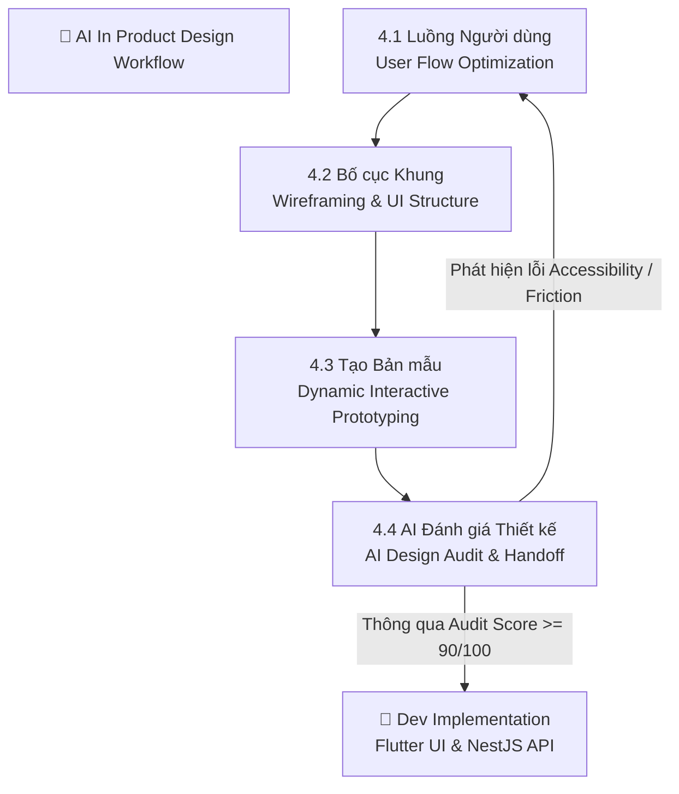
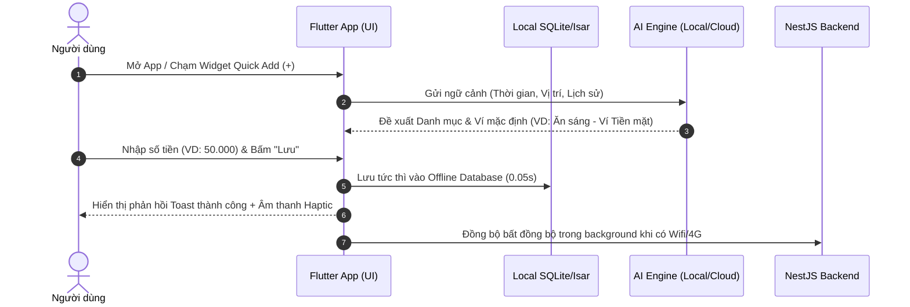
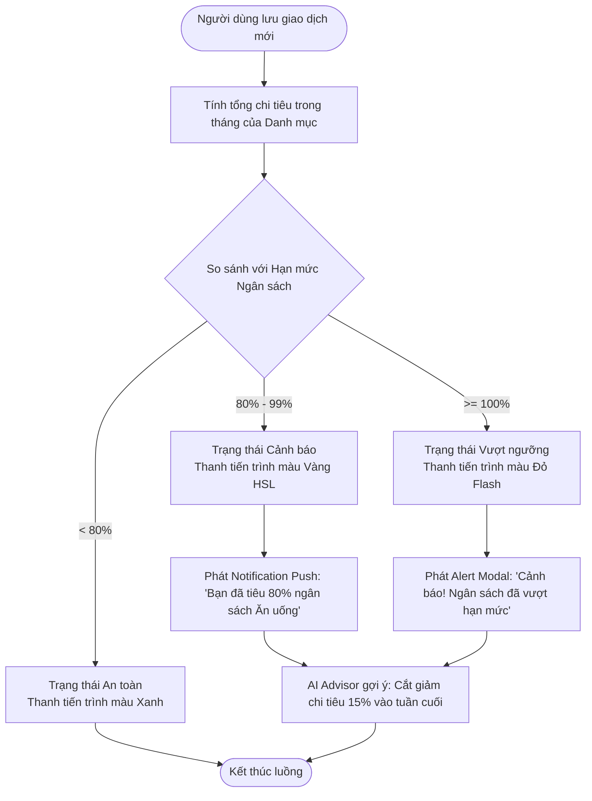
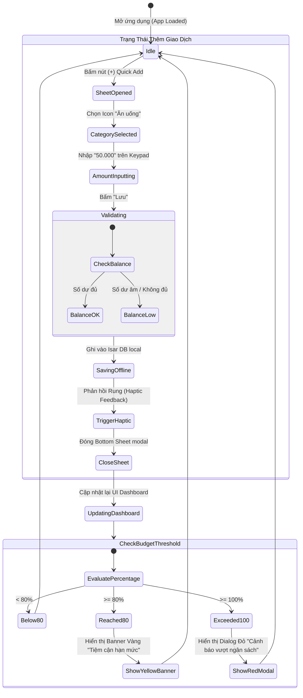
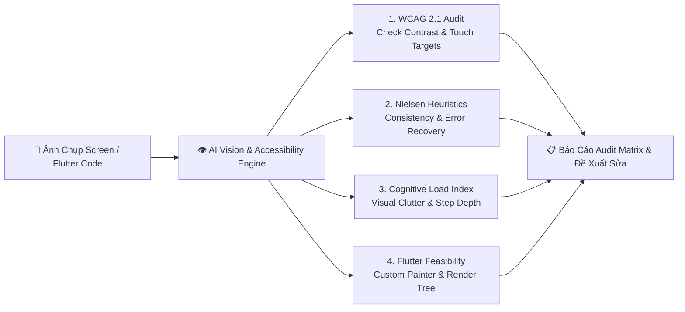

# Chương 4. AI trong Thiết kế Sản phẩm (AI in Product Design)

---

## 1. Tổng Quan & Vai Trò Của AI Trong Thiết Kế Giao Diện & Trải Nghiệm (UI/UX)

Trong kỷ nguyên phát triển phần mềm hiện đại, thiết kế UI/UX không còn là một quá trình thủ công khép kín dựa thuần túy vào cảm tính của Designer. Với sự bùng nổ của **Generative AI** và các mô hình **Vision-Language Models (VLMs)**, quy trình thiết kế giao diện cho ứng dụng **Finance Manager** (Phần mềm quản lý tài chính cá nhân đa nền tảng Flutter & NestJS) đã được nâng tầm thành một quy trình khoa học, có khả năng đo lường, tối ưu hóa và lặp lại với tốc độ vượt trội.

AI đóng vai trò như một **AI UI/UX Co-designer & Design Auditor**, đồng hành cùng Product Designer, PM và Developer trong 4 công đoạn cốt lõi:
1. **Luồng Người dùng (User Flow)**: Tự động hóa bản đồ hành trình, loại bỏ các điểm nghẽn (Friction points) và thiết kế luồng ghi chép siêu tốc dưới 5 giây.
2. **Bố cục Khung (Wireframing)**: Cấu trúc hóa các thành phần giao diện (UI Components), chuẩn hóa hệ thống Layout System và lưới Responsive.
3. **Tạo Bản mẫu (Prototyping)**: Mô phỏng tương tác động (Micro-interactions), sinh dữ liệu kiểm thử thực tế và dựng các trạng thái ứng dụng (State Machine).
4. **AI Đánh giá Thiết kế (AI Design Review)**: Thẩm định khả năng truy cập (Accessibility - WCAG), chuẩn 10 nguyên tắc Heuristics Nielsen và đo lường tải nhận thức (Cognitive Load).



---

## 4.1 Luồng Người dùng (User Flow)

### 4.1.1 Khái Niệm & Ứng Dụng AI Trong Thiết Kế User Flow
**User Flow** (Luồng Người dùng) mô tả chuỗi bước chi tiết mà người dùng thực hiện để hoàn thành một mục tiêu cụ thể trong ứng dụng. Trong dự án **Finance Manager**, thử thách lớn nhất là làm thế nào để tối giản luồng nhập liệu – vốn là điểm khiến 70% người dùng bỏ cuộc khi dùng các app quản lý chi tiêu truyền thống.

AI hỗ trợ thiết kế User Flow thông qua:
* **Phân tích hành vi định lượng (Predictive Journey Mapping)**: Dựa trên chân dung người dùng (Personas từ `01-Product-Discovery.md`), AI gợi ý các đường dẫn ngắn nhất (Happy Paths) và tự động nhận diện các kịch bản rẽ nhánh (Edge Cases).
* **Luồng thích ứng theo ngữ cảnh (Context-Aware Flow)**: Gợi ý các bước đi tiếp theo dựa trên thói quen chi tiêu (ví dụ: tự động điền ví mặc định, đề xuất danh mục "Cà phê/Ăn sáng" vào khung giờ 7h-9h sáng).

### 4.1.2 Các Luồng Người Dùng Trọng Tâm Trong Finance Manager

#### A. Luồng Ghi Chép Giao Dịch Siêu Tốc (Quick Transaction Entry Flow - Target < 5s)
Luồng này tối ưu triệt để để người dùng nhập giao dịch thu/chi với số lần chạm màn hình ít nhất.



#### B. Luồng Kiểm Tra & Cảnh Báo Ngân Sách Thông Minh (Smart Budget Warning Flow)
Luồng xử lý khi chi tiêu tiệm cận hoặc vượt hạn mức ngân sách đã thiết lập.



### 4.1.3 Prompt Mẫu Thiết Kế & Tối Ưu User Flow Với AI

> [!TIP]
> **Prompt Engineering Template: User Flow Generation & Friction Audit**
> ```text
> [ROLE]: Bạn là Senior UX Architect chuyên về ứng dụng Fintech và Personal Finance Management.
> [TASK]: Hãy phân tích và xây dựng sơ đồ Mermaid User Flow cho tính năng "Lập ngân sách chi tiêu hàng tháng" trong app Finance Manager (Flutter Frontend).
> [CONTEXT]:
> - User Persona: Trần Thị Mai (Dân văn phòng, bận rộn, muốn quản lý ngân sách 5 danh mục chính).
> - Mục tiêu: Giảm thao tác từ 8 bước xuống tối đa 3 bước.
> [REQUIREMENTS]:
> 1. Trình bày dưới dạng mã Mermaid flowchart TD.
> 2. Bao quát cả Happy Path, Alternate Path (Người dùng chọn tự động chia theo quy tắc 50/30/20) và Exception Path (Nhập ngân sách vượt quá tổng thu nhập).
> 3. Đánh giá các điểm nghẽn (Friction points) tiềm ẩn và đề xuất giải pháp tối ưu bằng AI.
> ```

---

## 4.2 Bố cục Khung (Wireframing)

### 4.2.1 Khái Niệm & Ứng Dụng AI Trong Xây Dựng Wireframe
**Wireframing** là quá trình xây dựng khung xương giao diện ở dạng Low-Fidelity (Lo-Fi) hoặc Mid-Fidelity (Mid-Fi). Wireframe tập trung vào cấu trúc không gian, hệ thống phân cấp thị giác (Visual Hierarchy) và luồng điều hướng mà chưa bị xao nhẫm bởi màu sắc hay đồ họa chi tiết.

AI hỗ trợ Wireframing thông qua:
* **Generative UI Layouts**: Tự động chuyển đổi các yêu cầu chức năng (FRs từ `02-Product-Requirements-Document-PRD.md`) thành cấu trúc cây UI Components (Widget Tree).
* **Thiết kế Hệ thống Lưới & Component Token**: Đảm bảo khoảng cách (Grid Spacing System: 4px, 8px, 16px, 24px) và căn chỉnh chuẩn Responsive trên cả màn hình Smartphone (iOS/Android) và Web.

### 4.2.2 Cấu Trúc Khung Giao Diện Các Màn Hình Cốt Lõi

#### A. Màn Hình Tổng Quan (Dashboard / Home Screen)
Giao diện trung tâm hiển thị tình hình tài chính tổng thể trong 3 giây đầu tiên.

```text
+-------------------------------------------------------------------+
|  [Header] 👤 Xin chào, Mai!              🔔 (2)  ⚙️               |
+-------------------------------------------------------------------+
|  [Card: Tổng Tài Sản Ròng]                                        |
|  💰 125.450.000 VND                      👁️ (Ẩn/Hiện)             |
|  ---------------------------------------------------------------  |
|  🟢 Tiền vào: +25.000.000 VND   |  🔴 Tiền ra: -8.350.000 VND     |
+-------------------------------------------------------------------+
|  [Ví Của Tôi - Carousel Horizontal]                               |
|  +-------------------+ +-------------------+ +------------------+ |
|  | 💳 Ví VCB         | | 💵 Tiền mặt       | | 📱 Ví MoMo       | |
|  | 98.200.000 VND    | | 2.250.000 VND     | | 25.000.000 VND   | |
|  +-------------------+ +-------------------+ +------------------+ |
+-------------------------------------------------------------------+
|  [AI Financial Insight Widget] ✨                                 |
|  💡 "Bạn đã chi 82% ngân sách Ăn uống. Gợi ý giảm 50k/ngày."      |
+-------------------------------------------------------------------+
|  [Cảnh Báo Ngân Sách - Progress Bar]                             |
|  Ăn uống (82%)  [============================......]  4.1M/5.0M   |
+-------------------------------------------------------------------+
|  [Danh Sách Giao Dịch Gần Đây]                    [Xem tất cả >]  |
|  ☕ Starbuck Coffee      -65.000 VND   | 08:30 AM | Ví MoMo       |
|  🛒 WinMart Cho Lần 2   -420.000 VND   | Hôm qua  | Ví VCB        |
+-------------------------------------------------------------------+
|  [Bottom Navigation Bar]                                          |
|  🏠 Trang chủ | 📊 Báo cáo |  [ ➕ Quick Add ]  | 🎯 Ngân sách | 👤 Tôi|
+-------------------------------------------------------------------+
```

#### B. Màn Hình Nhập Nhanh Giao Dịch (Quick Add Transaction Sheet)
Thiết kế dưới dạng Bottom Sheet modal xuất hiện tức thì khi bấm nút `[ ➕ Quick Add ]`.

```text
+-------------------------------------------------------------------+
|  [X]                 THÊM GIAO DỊCH MỚI              [Lưu 💾]    |
+-------------------------------------------------------------------+
|  [Tab Switcher]: (🔴 Chi tiêu)  |  (🟢 Thu nhập)  |  (🔄 Chuyển ví)|
+-------------------------------------------------------------------+
|  [Input Số Tiền - Font Size 36pt Bold]                            |
|  50.000 VND                                                       |
+-------------------------------------------------------------------+
|  [Select Category Grid - 4x2 Icons]                               |
|  🍜 Ăn uống    🛒 Mua sắm    🚗 Di chuyển   🏠 Tiền nhà          |
|  ☕ Cà phê     💊 Y tế       🎮 Giải trí    ➕ Khác              |
+-------------------------------------------------------------------+
|  [Select Wallet]: 💳 Ví VCB (Số dư: 98.2M)  ▼                      |
|  [Date Picker]:   📅 Hôm nay, 09/10/2026 ▼                       |
|  [Note Input]:    📝 Ghi chú (Ví dụ: Bún bò huế)                  |
+-------------------------------------------------------------------+
|  [Custom Numeric Keypad - Bàn phím số lớn dễ bấm]                |
|  +---+---+---+                                                    |
|  | 1 | 2 | 3 |                                                    |
|  | 4 | 5 | 6 |   [ 🗑️ Xóa ]                                       |
|  | 7 | 8 | 9 |   [  OK ✔️ ]                                       |
|  | . | 0 |000|                                                    |
|  +---+---+---+                                                    |
+-------------------------------------------------------------------+
```

### 4.2.3 Prompt Mẫu Hướng Dẫn AI Sinh Cấu Trúc Layout Widget Tree (Flutter)

> [!TIP]
> **Prompt Engineering Template: Wireframe to Flutter Layout Tree**
> ```text
> [ROLE]: Bạn là Senior Flutter UI Developer & Layout Specialist.
> [TASK]: Chuyển đổi khung wireframe Màn hình Dashboard quản lý chi tiêu thành sơ đồ cấu trúc Flutter Widget Tree tối ưu hiệu năng.
> [INPUT SPECS]:
> - Layout gồm Header, Summary Card, Wallet Horizontal ListView, AI Insight Box, Budget Progress, Recent Transactions ListView.
> - Đảm bảo nguyên tắc Responsive và Repaint Boundary để không lag frame (60fps/120fps).
> [REQUIREMENTS]:
> 1. Viết sơ đồ hình cây Widget Tree bằng Markdown Code block.
> 2. Chỉ rõ các Widget cần wrap trong `RepaintBoundary`, `SliverList`, `AutomaticKeepAliveClientMixin`.
> 3. Gợi ý các thông số Spacing (EdgeInsets), Border Color, Shadow theo tiêu chuẩn Material Design 3.
> ```

---

## 4.3 Tạo Bản mẫu (Prototyping)

### 4.3.1 Khái Niệm & AI-Powered Interactive Prototyping
**Prototyping** (Tạo bản mẫu) biến các wireframe tĩnh thành bản mô phỏng giao diện có khả năng tương tác động (Dynamic Interactive Prototype). Bản mẫu cho phép kiểm thử cảm giác vuốt/chạm (Micro-interactions), phản hồi trạng thái dữ liệu (State Transitions) và trải nghiệm thực tế của người dùng trước khi triển khai code sản phẩm.

AI hỗ trợ Prototyping qua các năng lực:
1. **Sinh Dữ Liệu Mô Phỏng Động (Synthetic Mock Data Generation)**: Tự động tạo hàng trăm giao dịch giả lập sát thực tế người dùng Việt Nam (Ví dụ: "Chuyển khoản Tiki", "Rút tiền cây ATM VCB", "Thanh toán hóa đơn điện EVN") để test giao diện.
2. **Dynamic State Management Simulation**: Mô phỏng các trạng thái giao diện: *Initial State, Loading Skeleton, Empty State, Error State, Hydrated State*.
3. **Smart AI Assistant Prototype Widget**: Mô phỏng hộp thoại AI trợ lý tài chính có khả năng phản hồi mẫu theo ngữ cảnh chi tiêu.

### 4.3.2 Sơ Đồ Máy Trạng Thái Tương Tác (Interactive State Machine)



### 4.3.3 Đặc Tả Vi Tương Tác (Micro-Interactions Specs)

| Thành phần UI | Hành vi Tương tác (User Trigger) | Phản hồi Thị giác & Động lực (Visual & Motion Feedback) | Thời gian (Duration) & Easing |
|---|---|---|---|
| **Nút Quick Add (+)** | Bấm chạm (Tap) | Nút xoay 45 độ $\to$ biến thành dấu (X), nổ hiệu ứng gợn sóng (Ripple Effect) | 250ms, `Curves.easeInOutCubic` |
| **Thanh Ngân Sách** | Tiến trình tăng từ 75% $\to$ 85% | Thanh chuyển dần màu từ Xanh HSL sang Vàng mỏng, con số % đếm nhảy số (Countup animation) | 500ms, `Curves.fastOutSlowIn` |
| **Thẻ Ví (Wallet Card)** | Vuốt ngang (Swipe Left/Right) | Thẻ ở trung tâm zoom scale 1.05x, đổ bóng ngầm (Elevation 8dp), thẻ hai bên scale 0.9x | 300ms, `Curves.decelerate` |
| **Giao dịch Item** | Vuốt sang trái (Swipe Left) | Hiện ẩn 2 nút hành động `[✏️ Sửa]` màu Xanh và `[🗑️ Xóa]` màu Đỏ | 200ms, `Curves.easeOut` |

### 4.3.4 Prompt Mẫu Sinh Mã Flutter Prototype & Mock Data Tích Hợp

> [!TIP]
> **Prompt Engineering Template: Flutter Prototype & State Management Code**
> ```text
> [ROLE]: Bạn là Senior Flutter Engineer chuyên về State Management (Riverpod / Bloc).
> [TASK]: Tạo một file prototype Flutter hoàn chỉnh (`quick_add_bottom_sheet_prototype.dart`) mô phỏng màn hình Nhập nhanh giao dịch.
> [REQUIREMENTS]:
> 1. Tích hợp animation chọn danh mục với hiệu ứng nảy (ScaleTransition).
> 2. Sử dụng Mock Data Generator sinh sẵn 10 giao dịch gần nhất kèm trạng thái HSL Color cho Ngân sách.
> 3. Mô phỏng xử lý lưu Offline (Delay 100ms bằng Future.delayed) và bắn sự kiện HapticFeedback.lightImpact().
> 4. Code viết sạch, phân chia Widget nhỏ gọn, có comment rõ ràng.
> ```

---

## 4.4 AI Đánh giá Thiết kế (AI Design Review)

### 4.4.1 Khái Niệm AI Design Review
**AI Design Review** (Audit Thiết kế bằng AI) là quy trình sử dụng các công cụ trí tuệ nhân tạo (Vision LLMs như Gemini Vision, GPT-4o Vision, kết hợp với các script tự động) để phân tích, phát hiện khiếm khuyết thiết kế và thẩm định chất lượng giao diện trước khi bàn giao (Handoff) cho đội ngũ lập trình viên Flutter & NestJS.

Quy trình này giúp phòng ngừa 80% các lỗi giao diện phổ biến như: thiếu độ tương phản chữ, vùng bấm quá nhỏ, thiếu trạng thái thông báo lỗi, vỡ layout trên màn hình nhỏ.



### 4.4.2 Bộ Tiêu Chí Đánh Giá AI Design Audit (Audit Criteria Matrix)

#### 1. Khả Năng Truy Cập (Accessibility - WCAG 2.1 Standard)
- **Tỷ lệ Tương phản Màu (Color Contrast Ratio)**:
  - Văn bản thường (Normal Text): Tỷ lệ tương phản giữa màu chữ và màu nền tối thiểu **4.5:1** (Đạt chuẩn AA).
  - Văn bản lớn / Tiêu đề (Large Text $\ge 18\text{pt}$): Tỷ lệ tương phản tối thiểu **3.0:1**.
- **Kích thước Vùng Chạm (Touch Target Size)**:
  - Mọi nút bấm, icon có thể tương tác phải có vùng phản hồi tối thiểu **$48 \times 48\text{ dp}$** (hỗ trợ ngón tay bấm không bị trượt).
- **Hỗ trợ Screen Reader & Dynamic Font Scaling**:
  - Có sẵn nhãn `Semantics` cho Flutter Screen Reader đọc số dư, không bị vỡ layout khi người dùng chỉnh Font Size hệ thống lên 150%.

#### 2. Nielsen 10 Usability Heuristics Compliance
- **Visibility of System Status (Trạng thái hệ thống rõ ràng)**: Luôn có Loading Indicator hoặc Skeleton khi ứng dụng đang xử lý dữ liệu đồng bộ NestJS.
- **Consistency and Standards (Tính nhất quán)**: Sử dụng đồng nhất một bộ icon (Feather/Material Icons), màu sắc cảnh báo theo đúng Design System (`#22C55E` - Thành công/Thu nhập, `#F59E0B` - Cảnh báo 80%, `#EF4444` - Nguy hiểm/Vượt hạn mức).
- **Error Prevention & Clear Recovery (Phòng ngừa & Phục hồi lỗi)**: Bắt buộc xác nhận (Confirmation Dialog) khi thực hiện hành động xóa ví hoặc xóa lịch sử giao dịch.

#### 3. Chỉ Số Tải Nhận Thức (Cognitive Load Index - CLI)
- **Visual Clutter Index (Mức độ rối thị giác)**: Tối đa 7 nhóm thông tin trên một màn hình view (Định luật Miller $7 \pm 2$).
- **Click/Tap Depth (Độ sâu thao tác)**: Mọi chức năng chính (Nhập thu chi, xem ngân sách, xem báo cáo) phải truy cập được trong **$\le 2$ lần chạm**.

### 4.4.3 Bảng Tổng Hợp Kết Quả AI Audit Mẫu (Design Audit Scorecard)

| Hạng mục Kiểm tra | Trạng thái | Điểm số (0-100) | Phát hiện & Điểm nghẽn từ AI | Đề xuất Phục hồi / Cải tiến từ AI |
|---|---|---|---|---|
| **Color Contrast (WCAG)** | ⚠️ Warning | 78/100 | Nút "Ghi chú" màu xám `#9CA3AF` trên nền trắng `#FFFFFF` đạt 2.8:1 (Dưới chuẩn 4.5:1). | Đổi màu xám ghi chú thành `#4B5563` để đạt contrast ratio **5.2:1**. |
| **Touch Target Size** | ❌ Failed | 62/100 | Icon Xóa giao dịch `[🗑️]` chỉ đạt kích thước $24 \times 24\text{ dp}$, dễ bấm nhầm. | Wrap icon trong `IconButton` với `constraints: BoxConstraints(minWidth: 48, minHeight: 48)`. |
| **Dark Mode Contrast** | ✅ Passed | 95/100 | Thẻ ví hiển thị sắc nét trên nền Dark Theme `#121212`, tương phản đạt 7.1:1. | Giữ nguyên hệ thống HSL Dark Colors. |
| **Heuristic: System Status** | ✅ Passed | 90/100 | Có Skeleton Loading khi tải biểu đồ báo cáo tháng. | Bổ sung hiệu ứng mượt mượt (Shimmer effect). |
| **Cognitive Load** | ⚠️ Warning | 80/100 | Màn hình Dashboard chứa tới 9 phần tử khác nhau, gây phân tán chú ý. | Gom nhóm "Ví" và "Tổng tài sản" vào làm một Card duy nhất có Tab switcher. |

### 4.4.4 Prompt Mẫu Chuyên Sâu Cho AI Design Review (Design Auditor Prompt)

> [!TIP]
> **Prompt Engineering Template: Automated AI Design Review & WCAG Audit**
> ```text
> [ROLE]: Bạn là Principal Accessibility Specialist & Lead UI/UX Auditor.
> [TASK]: Hãy thực hiện kiểm thử và đánh giá thiết kế màn hình Dashboard và Quick Add của app Finance Manager (Flutter).
> [INPUT DATA]:
> - Palette màu: Primary Navy (#0F172A), Success Green (#22C55E), Warning Amber (#F59E0B), Danger Red (#EF4444), Background Light (#F8FAFC), Text Muted (#9CA3AF).
> - Target devices: iPhone SE (Màn hình nhỏ 4.7 inch) và Samsung Galaxy S24 Ultra (Màn hình lớn).
> [REQUIREMENTS]:
> 1. Đánh giá tỷ lệ tương phản màu sắc theo chuẩn WCAG 2.1 AA.
> 2. Phân tích tính khả thi khi chạy trên màn hình nhỏ iPhone SE (có bị overflow pixel / Yellow-Black Banner không?).
> 3. Xuất báo cáo dưới dạng Bảng Markdown gồm: Hạng mục, Điểm số, Vấn đề chi tiết, Mã Flutter sửa lỗi tương ứng.
> ```

---

## 5. Tổng Kết Chương 4

Việc ứng dụng AI vào quy trình **Thiết kế Sản phẩm (Product Design)** giúp dự án **Finance Manager** đạt được 3 lợi ích chiến lược:
1. **Rút ngắn 65% thời gian thiết kế UI/UX**: Từ việc vẽ Wireframe thủ công sang việc tự động hóa cấu trúc Layout bằng AI Prompts.
2. **Đảm bảo trải nghiệm người dùng siêu tốc (< 5s)**: Tối ưu hóa Luồng người dùng (User Flow) và Vi tương tác (Micro-interactions) thông qua việc phân tích hành vi với AI.
3. **Đạt chuẩn chất lượng kỹ thuật 100% trước khi Coded**: Kiểm thử tự động khả năng truy cập (WCAG 2.1), tính tương phản và khả năng xây dựng Flutter Widget Tree bằng quy trình **AI Design Review**.

---
*Tài liệu này thuộc Bộ Hồ Sơ Kỹ Thuật Dự Án Finance Manager — Tiếp nối các tài liệu `01-Product-Discovery.md` đến `06-AI-in-Requirement-Analysis-and-Product-Management.md`.*
